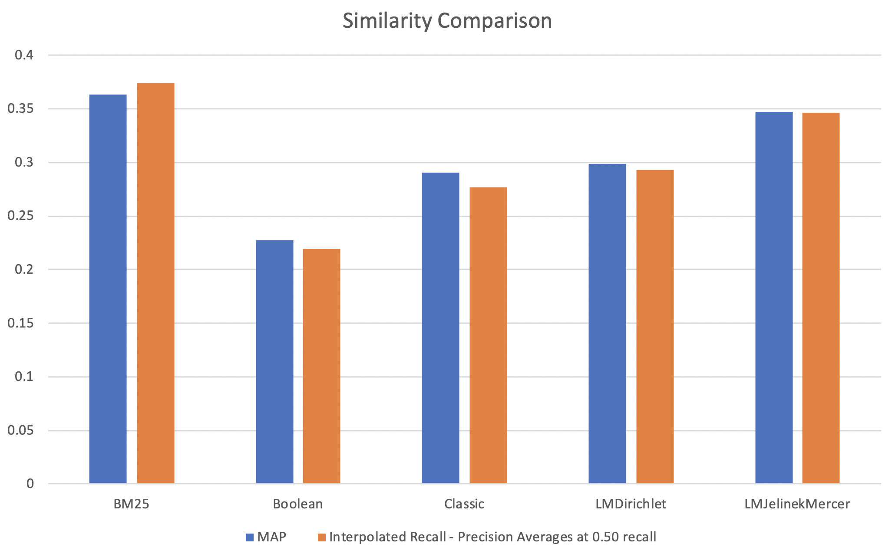

# Lucene-Information-Retrieval-1.0
## CS7IS3: Individual Project
### A study on Lucene Search Engine for Cranfield Dataset

This project uses Intellij Workspace with Maven configured.

This project uses Apache Lucene for the implementation of search engine. Lucene is an open source full-text search engine toolkit which is implemented in Java. This project uses Apache Lucene version 8.4.1 with OpenJDK 13.0.2 using JRE 8u241.

*Cranfield 1400* collection consists of 1398 abstracts along with 225 queries and the relevance judgments of all query.

### Final Output of QRel


### Comparison of Outputs of QRel



## Running the Project

1. Clone the repository.

2. Go to the directory to build the maven project.

```
cd ~/CS7IS3/Lucene-Information-Retrieval-1/
```

3. Do a Maven clean install.

```
mvn clean install
```

4. You need to Maven Execute the program with these given parameters in the given order.

```
mvn exec:java -Dexec.mainClass="IR.IndexFiles" -Dexec.args= "[-index] [-docs] [-queries] [-score] [-args_path]"
```

- ```[-index]``` 	  Path to mention where to save your index files after indexing.
- ```[-docs]```		  Path to the cran.all.1400 file, which is a single file with 1400 docs.
- ```[-queries]``` 	Path to cran.qry file, which is a single file 225 queries.
- ```[-score]```	  Score determines the which Similarity Index you want to use.
- ```[-args_path]```  Path to mention where to save the output relevance file.
##### ```[-score]``` Parameter Values
- 0 for ClassicSimilarity
- 1 for BM25Similarity (Gives Best MAP Score)
- 2 for BooleanSimilarity
- 3 for LMDirichletSimilarity
- 4 for LMJelinekMercerSimilarity

## Evaluating the Output (TREC Eval)

Once you're done with generating the ```output.txt``` file you are ready to compare with the TREC Eval file.

1. Change the directory to the folder which contains the binary file of Trec Eval.

```
cd ~/../Lucene-Information-Retrieval-1/trec_eval-9.0.7
```

2. ```make``` to get an executable for TREC Eval.

```make```

3. Now run the TREC_EVAL against your output.

```
./trec_eval ~/../Lucene-Information-Retrieval-1/Files/QRelsCorrectedforTRECeval ~/../Lucene-Information-Retrieval-1/Files/outputs.txt
```
